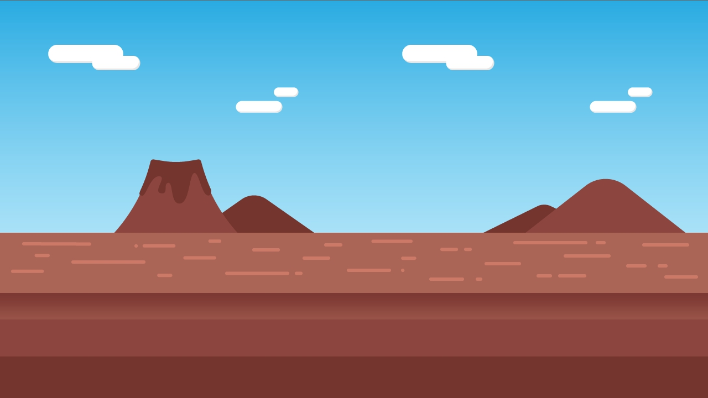

## STEP1. game 화면 구성하기 (display 배치로 워밍업)


1. 배경화면 세팅하기
    
    ```lua
    local bgGroup = display.newGroup();
    local background = display.newRect(bgGroup, display.contentCenterX, display.contentCenterY, display.contentWidth, display.contentHeight)

    local sky = display.newImageRect(bgGroup, "Content/Sky.png", display.contentWidth, display.contentHeight)
    sky.x, sky.y = display.contentCenterX, display.contentCenterY

    local ground = display.newImageRect(bgGroup, "Content/Ground.png", display.contentWidth, 300)
    ground.x, ground.y = display.contentCenterX, display.contentHeight-150

    sceneGroup:insert(bgGroup)
    ```


2. UI 세팅하기
    
    ``` lua
    local UIGroup = display.newGroup();
    local playUI = {}
    playUI[0] = display.newImageRect(UIGroup, "Content/play.png", 55, 55)
    playUI[0].x, playUI[0].y = 1180, 40
    playUI[0].alpha = 0
    playUI[1] = display.newImageRect(UIGroup, "Content/stop.png", 55, 55)
    playUI[1].x, playUI[1].y = 1180, 40

    local bgmUI = {}
    bgmUI[0] = display.newImageRect(UIGroup, "Content/on.png", 55, 55)
    bgmUI[0].x, bgmUI[0].y = 1240, 40
    bgmUI[0].alpha = 1
    bgmUI[1] = display.newImageRect(UIGroup, "Content/off.png", 55, 55)
    bgmUI[1].x, bgmUI[1].y = 1240, 40
    bgmUI[1].alpha = 0
    ```

    2-1. UI event 설정하기 (임시)
    ``` lua
    local function playPause( event )
		playUI[0].alpha = 0
		playUI[1].alpha = 1
		print("bgmPause")
	end
	local function playResume( event )
		playUI[0].alpha = 1
		playUI[1].alpha = 0
		print("bgmResume")
	end
	playUI[0]:addEventListener("tap", playPause)
	playUI[1]:addEventListener("tap", playResume)

	local function bgmPause( event )
		bgmUI[0].alpha = 0
		bgmUI[1].alpha = 1
		print("bgmPause")
	end
	local function bgmResume( event )
		bgmUI[0].alpha = 1
		bgmUI[1].alpha = 0
		print("bgmResume")
	end
	bgmUI[0]:addEventListener("tap", bgmPause)
	bgmUI[1]:addEventListener("tap", bgmResume)
    ```

3. 점프/슬라이드 버튼 생성
    ```lua
    local sildeButton = widget.newButton(
		{
			shape ="circle", radius = 75,
			fillColor = { default={ 1, 0.2, 0.5, 1 }, over={ 1, 0.2, 0.5, 0.7 } },
			x = 200, y = 600
		}
	)
	local jumpButton = widget.newButton(
		{
			shape ="circle", radius = 75,
			fillColor = { default={ 1, 0.2, 0.5, 1 }, over={ 1, 0.2, 0.5, 0.7 } },
			x = 1100, y = 600
		}
	)
	sceneGroup:insert(sildeButton)
	sceneGroup:insert(jumpButton)
    ```