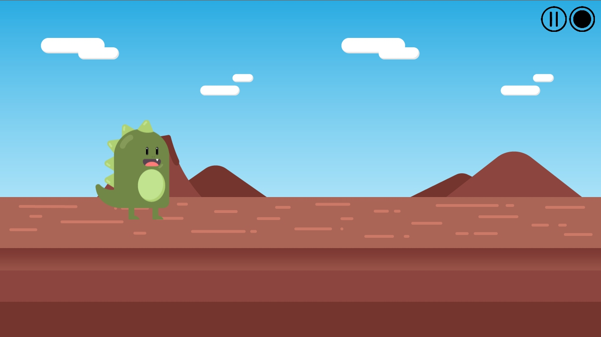
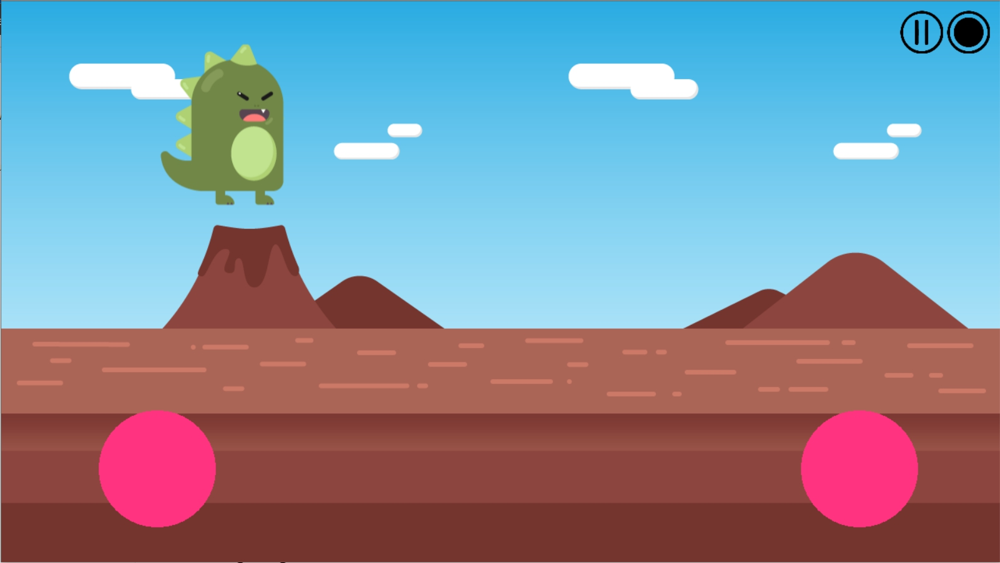
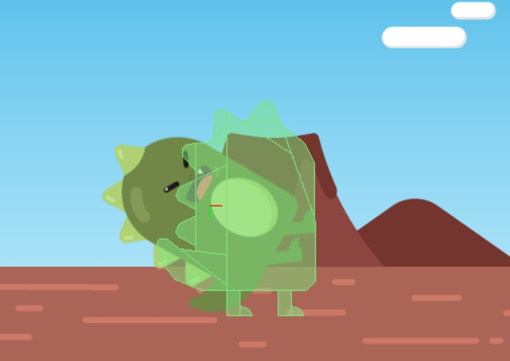
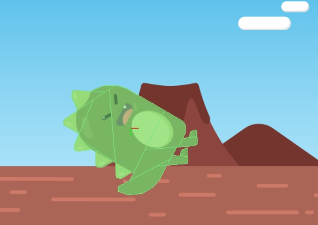

## 공룡 생성하기

공룡을 넣을 껀데 공룡은 너무 복잡하니까 외부 모듈로 넣어보겠어요~

1. 공룡 생성하기 (module.dino, Scene.game)
    
    ```lua
    local imgSheet = graphics.newImageSheet( "Content/Playerd.png", { width = 214, height = 217, numFrames = 6 })
    local sepuencesData = {
        { name = "idle",	start = 1, count = 1 },
        { name = "run",  	start = 1, count = 3, time = 400 },
        { name = "jump", 	start = 4, count = 1 },
        { name = "silde", 	start = 5, count = 1 },
        { name = "collide", start = 6, count = 1 }
    }

    local dino = display.newSprite(imgSheet, sepuencesData)

    return dino
    ```

    ```lua
    local dino = require( "module.dino" )
	dino.x, dino.y = display.contentWidth*0.2, display.contentCenterY

    sceneGroup:insert(dino)
    ```

2. 공룡 움직이기 (module.dino, Scene.game)
    
    ```lua
    function dino:animation( state )
        dino:setSequence( state )
        dino:play()
    end
    ```

    ```lua
    dino:animation("run")
    ```

    공룡 애니메이션이 실행된다. "jump", "silde", "collide" 들도 한 번씩 넣어봐라.   
    ※ 넣어본 후에는 다시 run으로 돌려놓는다.

3. 점프 슬라이드 버튼 만들기
    ```lua
    local jumpButton = widget.newButton(
		{
			shape ="circle", radius = 75,
			fillColor = { default={ 1, 0.2, 0.5, 1 }, over={ 1, 0.2, 0.5, 0.7 } },
			x = 1100, y = 600,
		}
	)	
	local sildeButton = widget.newButton(
		{
			shape ="circle", radius = 75,
			fillColor = { default={ 1, 0.2, 0.5, 1 }, over={ 1, 0.2, 0.5, 0.7 } },
			x = 200, y = 600,
		}
	)
	sceneGroup:insert(jumpButton)
	sceneGroup:insert(sildeButton)
    ```

4. jump 이벤트

    3-1. 위로 상승까지 (dino.lua)
    
    ```lua
    function dino:jump() 
        dino:animation('jump')
        transition.to( dino, { time = 750,  y = (dino.y-200), transition = easing.linear} )
    end
    ```
    ```lua
    local jumpButton = widget.newButton(
		{
			shape ="circle", radius = 75, -- 임시
			fillColor = { default={ 1, 0.2, 0.5, 1 }, over={ 1, 0.2, 0.5, 0.7 } }, -- 임시
			x = 1100, y = 600,
			onRelease = function()
				dino:jump()
			end
		}
	)	
    ```

    3-2. 아래로 착지까지 (dino.lua)
    ```lua
    function dino:jump() 
        dino:animation('jump')
        transition.to( dino, { time = 750,  y = (dino.y-200), transition = easing.inOutSine,
            onComplete = function() 
                transition.to( dino, { time=750,  y = display.contentCenterY, transition = easing.inSine,
                    onComplete = function() 
                        dino:animation('run') 
                    end } )
            end 
        } )
    end
    ```

    3-3. 연속 점프 방지
    ```lua
    function dino:init()
        dino:animation('run')
        dino.isJump = false
    end

    function dino:jump() 
        if(dino.isJump == false) then
            dino.isJump = true
            dino:animation('jump')
            transition.to( dino, { time = 750,  y = (dino.y-200), transition = easing.inOutSine,
                onComplete = function() 
                    transition.to( dino, { time=750,  y = display.contentCenterY, transition = easing.inSine,
                        onComplete = function() 
                            dino.isJump = false
                            dino:animation('run')
                        end } )
                end 
            } )
        end
    end
    ```
    ```lua
    -- dino:animation('run')
	dino:init()
    ```

5. slide 이벤트
    ```lua
    function dino:sildeStart()
        if (dino.isJump == false) then
            dino:animation('silde')
        end
    end

    function dino:sildeEnd( event )
        if (dino.isJump == false) then
            dino:animation('run')
        end
    end
    ```
    ```lua
    local sildeButton = widget.newButton(
		{
			shape ="circle", radius = 75,
			fillColor = { default={ 1, 0.2, 0.5, 1 }, over={ 1, 0.2, 0.5, 0.7 } },
			x = 200, y = 600,
			onPress = function()
				dino:sildeStart()
			end,
			onRelease = function()
				dino:sildeEnd()
			end
		}
	)
    ```
6. physics 넣기
    ```lua
    function dino:init()
        dino:animation('run')
        dino.isJump = false
        
        physics.addBody(dino, "static", { outline = graphics.newOutline(2, imgSheet, 1) })
        physics.start()
    end
    ```
    
    

    ```lua
    local dinoOutline = {
        idle = graphics.newOutline(2, imgSheet, 1),
        silde = graphics.newOutline(2, imgSheet, 5)
    }

    function dino:init()
        dino:animation('run')
        dino.isJump = false
 
        physics.start()
        physics.addBody(dino, "static", { outline = dinoOutline.idle })
        physics.setDrawMode('hybrid')
    end
    ```

    ```lua
    function dino:sildeStart()
        if (dino.isJump == false) then
            dino:animation('silde')
            -- step3-6. dino physics
            physics.removeBody( dino )
            physics.addBody(dino, "static", { friction=0, outline = dinoOutline.silde }) 
        end
    end

    function dino:sildeEnd( event )
        if (dino.isJump == false) then
            dino:animation('run')
            -- step3-6. dino physics
            physics.removeBody( dino )
            physics.addBody(dino, "static", { friction=0, outline = dinoOutline.idle}) 
        end
    end
    ```
